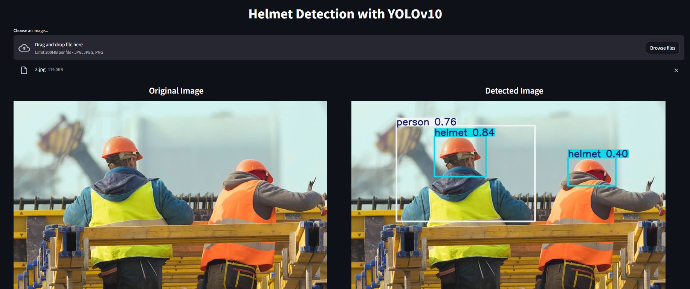

# Helmet Detection with YOLOv10

## How to run
To use the project, follow these steps:

1. Clone repo:
    ```bash
    git clone https://github.com/dangmanh18112004/Object-Detection-with-YOLO.git
    ```

2. Install dependencies:
    ```bash
    pip install -r requirements.txt
    ```

3. Run:
    ```bash
    streamlit run app.py
    ```
## Demo


